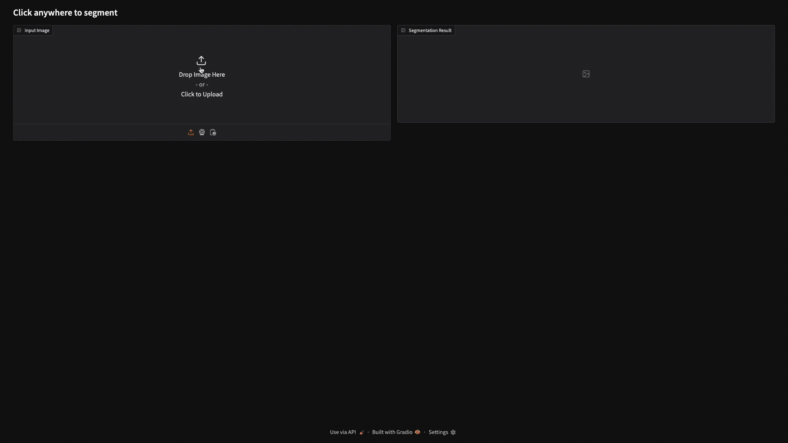

# Advanced Pet Image Segmentation: A Comparative Study

<p align="center">
  
  
  
  
  
  
  
</p>



This repository contains the implementation and analysis of four advanced deep learning architectures for image segmentation, evaluated on the Oxford-IIIT Pet Dataset. The project provides a comprehensive comparison of model performance, robustness, and the application of modern techniques like prompt-based segmentation.

---

## What is This Project?

This project investigates and compares the effectiveness of different neural network architectures for semantic segmentation, a critical task in computer vision that involves assigning a class label to every pixel in an image. The primary goal is to distinguish pets (cats and dogs) from the background with high precision.

Four distinct methodologies were implemented and evaluated:
1.  A traditional **U-Net Architecture**.
2.  A **U-Net with a pre-trained Autoencoder** to learn feature representations.
3.  A modern decoder architecture using a frozen **CLIP Vision Transformer** as its encoder.
4.  An interactive **Point-Prompt Segmentation Model** built upon the CLIP architecture.

---

## Why is This Useful?

Image segmentation is a fundamental technology that powers applications in autonomous driving, medical imaging, and robotics. This project demonstrates the practical application of cutting-edge deep learning techniques to solve a challenging segmentation problem.

For a recruiter or developer, this repository showcases:
* **Mastery of Advanced Architectures**: Deep understanding and implementation of multiple complex models, from the classic U-Net to modern transformer-based approaches like CLIP.
* **Robust and Reliable Models**: The project includes a thorough robustness analysis, testing the best model against various image corruptions like noise, blur, and occlusions to prove its real-world viability. The model maintained a Dice score above 0.9 even under severe degradation[cite: 64, 1180].
* **Practical Application**: The development of an interactive user interface using Gradio for the prompt-based model demonstrates the ability to build and deploy functional machine learning applications.
* **Strong Foundations**: Expertise in data preprocessing, advanced data augmentation with Albumentations, and rigorous model evaluation.

---

## How It Works & Key Results

The project was structured as a comparative study to determine the most effective architecture for the task. All models were trained and evaluated on the Oxford-IIIT Pet Dataset, with images resized to a standard $224 \times 224$ resolution.

### Methodologies Explored

1.  **Standard U-Net**: Implemented the classic U-shaped encoder-decoder architecture with skip connections, serving as a strong baseline for the task.
2.  **Autoencoder Pre-training**: This two-phase approach first trained an autoencoder to reconstruct images in an unsupervised manner. The trained encoder, having learned valuable low-level features, was then frozen and used as the backbone for the main segmentation model.
3.  **CLIP-based Segmentation**: This method leverages the power of transfer learning by using a pre-trained CLIP vision transformer as a frozen feature extractor. Trained on vast image-text pairs, CLIP provides rich semantic features that are highly effective for segmentation.
4.  **Point-Prompt Segmentation**: **(Best Performing Model)** This advanced model enhances the CLIP-based architecture by incorporating user input. It takes an image and a single user-provided point (as a Gaussian heatmap) to guide the segmentation process, allowing for highly accurate, context-aware predictions.

### Performance Comparison

The models were evaluated on their mean Intersection-over-Union (mIoU) and Dice Score on the test set. The point-based model using CLIP features demonstrated vastly superior performance.

| Architecture | Test Loss | mIoU | Dice Score | Accuracy |
| :--- | :---: | :---: | :---: | :---: |
| U-Net | 0.3051 | 0.4702 | 0.8660 | 0.5982 |
| Autoencoder Pre-training | 0.4284 | 0.3969 | 0.6726 | 0.5127 |
| CLIP Features | 0.0871 | 0.5967 | 0.9670 | 0.9471 |
| **Point-Based (CLIP)** | **0.1733** | **0.9261** | **0.8421** | **0.9144** |
> _Results extracted from Table 1._

The **Point-Based Segmentation model achieved an outstanding mIoU of 0.9261**, significantly outperforming all other approaches and demonstrating the power of combining rich semantic features from CLIP with explicit spatial guidance.

### 🖼️ Interactive Demo

An interactive user interface was developed with **Gradio** to showcase the point-based segmentation model. Users can upload any image, click on an object of interest, and the model will generate and overlay the corresponding segmentation mask in real-time.

---

## 🛠️ How to Run

### Prerequisites

* Python 3.8+
* PyTorch
* [Oxford-IIIT Pet Dataset](https://www.robots.ox.ac.uk/~vgg/data/pets/)

### Installation

1.  **Clone the repository:**
    ```bash
    git clone [https://github.com/your-username/your-repo-name.git](https://github.com/your-username/your-repo-name.git)
    cd your-repo-name
    ```

2.  **Create a virtual environment and install dependencies:**
    ```bash
    python -m venv venv
    source venv/bin/activate
    pip install -r requirements.txt
    ```
    *(Note: You will need to create a `requirements.txt` file based on the imports in the provided code.)*

3.  **Download the Dataset:**
    Download the Oxford-IIIT Pet Dataset and extract it. The code expects a directory structure with `TrainVal` and `Test` folders, each containing `color` and `label` subdirectories. Update the root path in the scripts accordingly.

### Running the Code

* **To train a model (e.g., the U-Net):**
    ```bash
    python unet_notebook.py
    ```

* **To launch the interactive UI:**
    ```bash
    python prompt_based_ui.py
    ```


